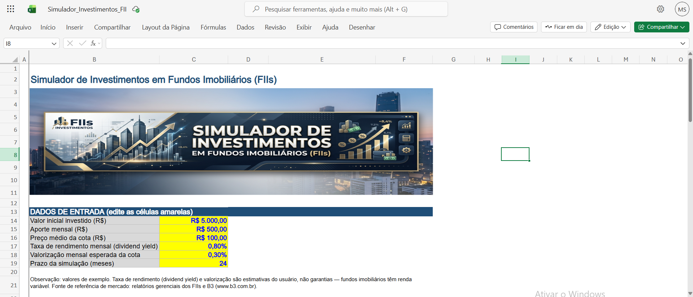

# Simulador de Investimentos em Fundos Imobiliários (FIIs)

Desafio de projeto do bootcamp **Santander — Excel com IA e Claude** (Digital Innovation One).



## Objetivo

Construir uma planilha em Excel que ajude um investidor a simular um aporte em Fundos de
Investimento Imobiliário (FIIs), respondendo às perguntas mais comuns de quem está começando:

- Quanto vou investir no total?
- Por quanto tempo devo manter o investimento?
- Qual dividendo mensal posso esperar, dado um dividend yield estimado?
- Como meu patrimônio evolui mês a mês, considerando aportes e valorização da cota?

## O que a planilha faz

O arquivo Simulador_Investimentos_FII.xlsx tem uma única
aba, **Simulador**, dividida em três blocos:

A aba **Simulador** conta com uma capa ilustrativa no topo, destacando o tema do projeto.

### 1. Dados de entrada (células amarelas, editáveis)
| Campo | Exemplo |
|---|---|
| Valor inicial investido (R$) | 5.000,00 |
| Aporte mensal (R$) | 500,00 |
| Preço médio da cota (R$) | 100,00 |
| Taxa de rendimento mensal (dividend yield) | 0,80% |
| Valorização mensal esperada da cota | 0,30% |
| Prazo da simulação (meses) | 24 |

### 2. Resultados da simulação (calculados automaticamente)
- Valor total investido
- Número estimado de cotas adquiridas
- Patrimônio acumulado ao final do prazo
- Total de dividendos recebidos no período
- Rendimento total, em R$ e em %

### 3. Evolução mensal do investimento
Uma tabela mês a mês (mês 0 até o prazo definido) mostrando, para cada mês:
- Aporte do mês
- Valor investido acumulado
- Patrimônio (valor de mercado, com valorização da cota)
- Dividendo do mês
- Dividendos acumulados

Toda a planilha é **100% orientada a fórmulas** (SUM, INDEX/MATCH, referências
absolutas/relativas) — ao alterar qualquer dado de entrada, todos os resultados e a tabela
mensal recalculam automaticamente. O prazo pode ser ajustado de 1 a 60 meses sem quebrar
nenhuma fórmula.

## Lógica de cálculo

Para cada mês n (com n-1 sendo o mês anterior):

```
Valor investido acumulado(n) = Valor investido acumulado(n-1) + Aporte mensal
Dividendo do mês(n)           = Patrimônio(n-1) × Taxa de rendimento mensal
Patrimônio(n)                 = Patrimônio(n-1) × (1 + Valorização mensal) + Aporte mensal
Dividendos acumulados(n)      = Dividendos acumulados(n-1) + Dividendo do mês(n)
```

**Aviso importante**: fundos imobiliários são investimentos de **renda variável**. A taxa
de rendimento mensal (dividend yield) e a valorização da cota usadas na simulação são
**estimativas informadas pelo usuário**, não promessas de retorno. Rentabilidade passada não
garante rentabilidade futura. Consulte sempre relatórios gerenciais dos fundos e a B3
(www.b3.com.br) antes de investir de verdade.

## Como usar

1. Baixe o arquivo Simulador_Investimentos_FII.xlsx.
2. Abra no Excel, LibreOffice Calc ou Google Sheets.
3. Edite apenas as células amarelas (dados de entrada).
4. Confira os resultados e a evolução mensal, que recalculam automaticamente.

## Aprendizados do desafio

- Modelagem de fórmulas financeiras encadeadas mês a mês em Excel.
- Uso de INDEX + MATCH para localizar o resultado final de acordo com um prazo variável,
  evitando fórmulas hardcoded.
- Boas práticas de organização visual de planilhas financeiras: cores para inputs (azul/amarelo)
  x fórmulas (preto), formatação de moeda e percentual.
- Documentação técnica de um projeto de dados/Excel em README.md para publicação no GitHub.

## Estrutura do repositório

```
.
├── README.md
├── Simulador_Investimentos_FII.xlsx
└── images/
    └── preview.png    (imagem de prévia usada no topo do README)
```

## Referências

- Material de apoio do desafio: DIO — Bootcamp Santander (Excel com IA e Claude)
- B3 — Fundos de Investimento Imobiliário: www.b3.com.br

---
Projeto desenvolvido por Marcelo como parte do bootcamp Santander na DIO.
